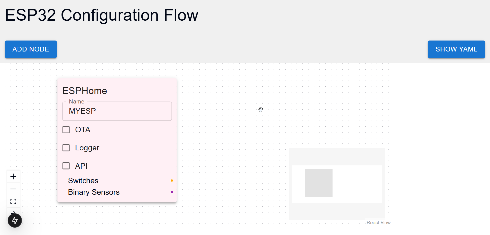
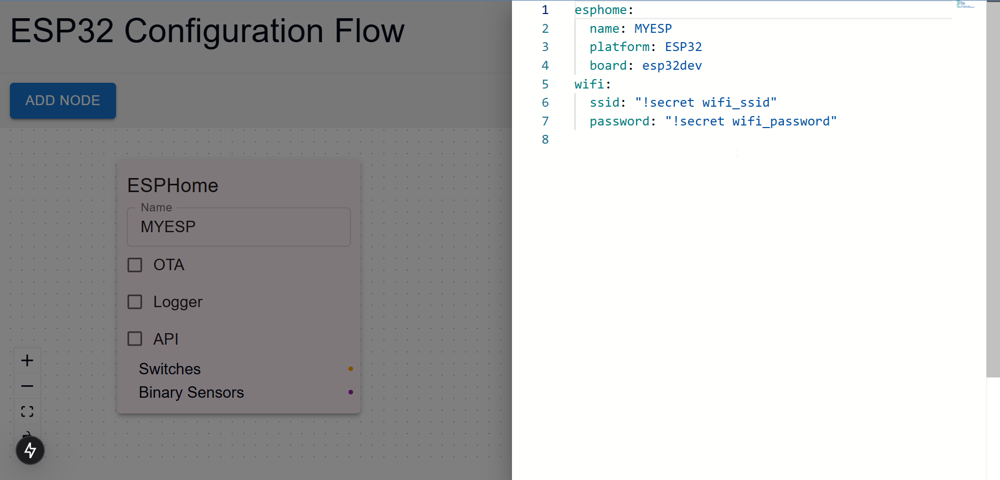
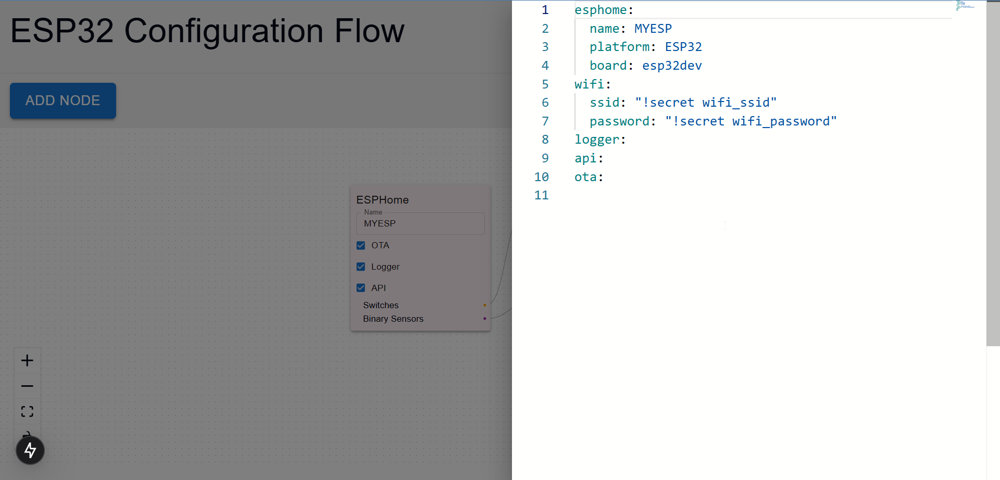
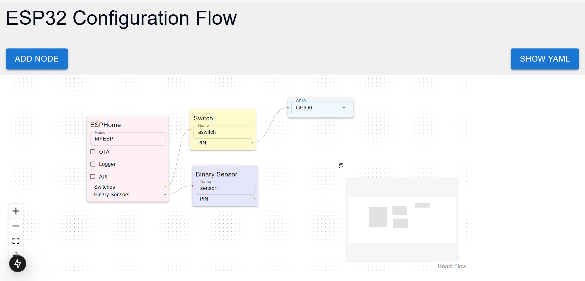

# ESPHome GUI
### Notice
This app is not functional yet, but a work in progress in order to prototype with the Idea

## About
This is a graphical user interface to generate ESPHome YAML configurations.

The idea is to have an easy to use interface to create ESPHome configurations without having to write YAML code. The interface is still in its infancy and not yet ready for production use.

The interface is built using the following technologies:

* Next.js as the frontend framework
* React Flow as the library for creating the flow-based interface
* Tailwind CSS as the CSS framework with shadcn

## Screenshots

## TODOs:
- [ ] figure out basic schema and structure
- [ ] include validation
- [ ] Add local storage saving with dexie
- [ ] Add analytics
- [ ] Check if I can auto generate node types and parms from esphome's schema
- [ ] Add example using google's blockly
- [ ] Fix UI and UX
- [ ] Create HA plugin
- [ ] Add workspaces, etc
- [ ] Add secrets
- [ ] Add reusable blocks within a workspace for example with conditions that compiles into lambdas
- [ ] Add platforms and board definitions
- [ ] Add sub-blocks and templates
- [ ] Add versioning and history, diffing, etc 